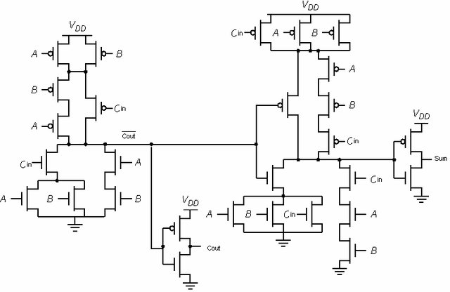
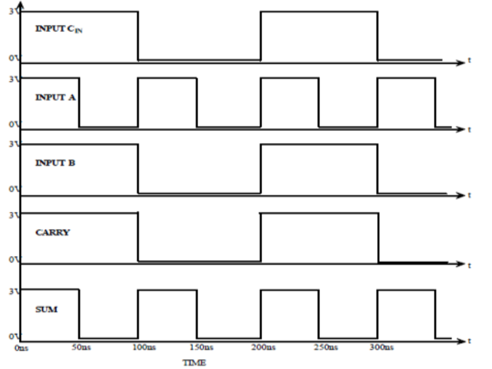
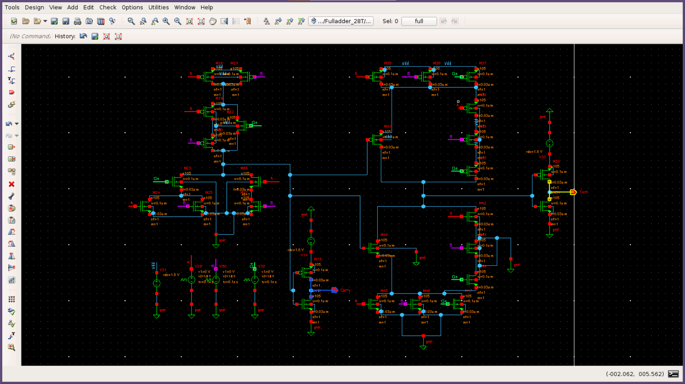
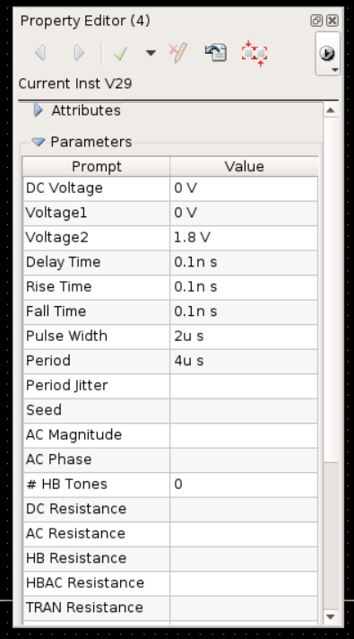
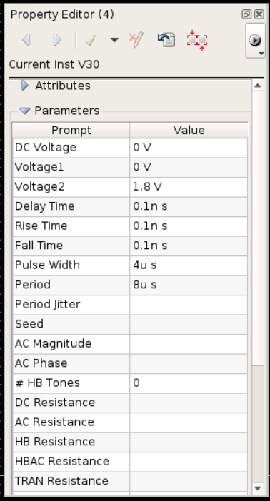
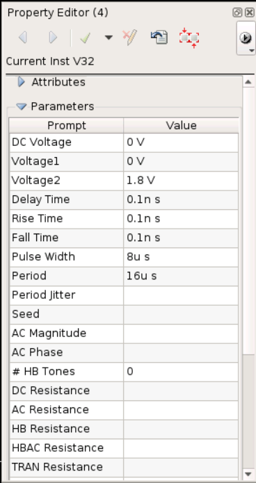
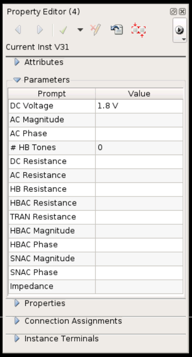
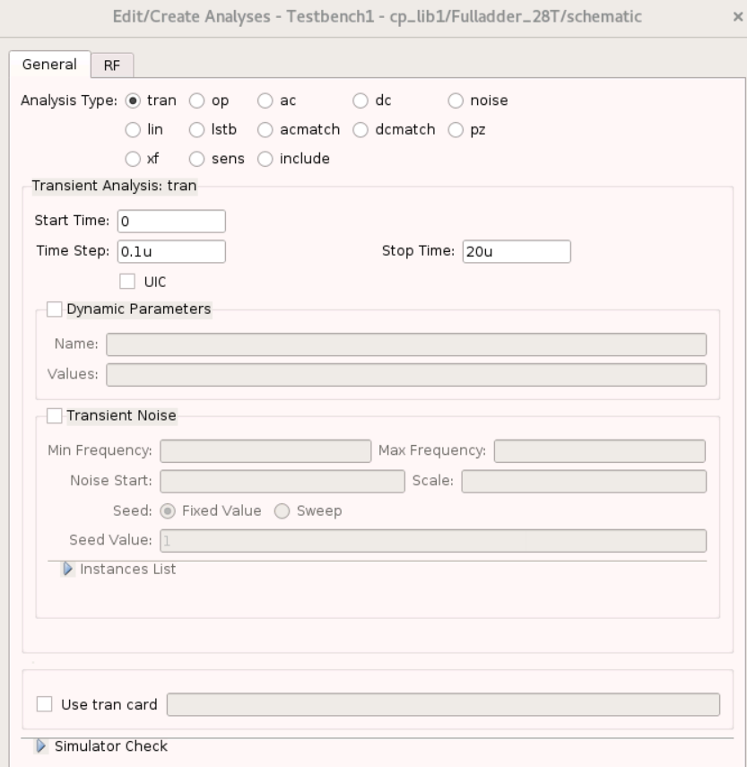
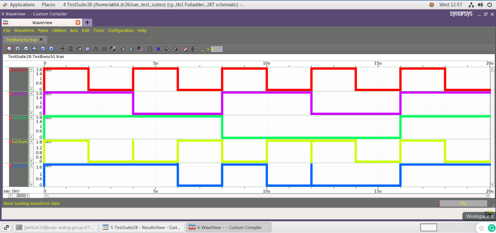

# Design of 28T CMOS Full Adder using Synopsys Custom-Compiler
This repository will maintain simulation files and other relevant files of the FULL ADDER block worked on the IITH/Synopsys/analogHackathon 2022

# Table of Contents
  * [Abstract](#abstract)
  * [Reference Circuit Details](#reference-circuit-details)
  * [Reference Circuit Diagram](#reference-circuit-diagram)
  * [Reference Circuit Waveform](#reference-circuit-waveform)
- [Simulation in Synopsys](#simulation-in-synopsys)
  * [Schematic](#schematic)
  * [Parameters set for Pulse Voltage Source for A](#parameters-set-for-pulse-voltage-source-for-A)
  * [Parameters set for Pulse Voltage Source for B](#parameters-set-for-pulse-voltage-source-for-B)
  * [Parameters set for Pulse Voltage Source for Cin](#parameters-set-for-pulse-voltage-source-for-Cin)
  * [Parameters set for DC Voltage Source for Vdc](#parameters-set-for-dc-voltage-source-for-Vdc)
  * [Transient Settings](#transient-settings)
  * [Netlist](#netlist)
  * [Waveform](#waveform)
 * [Conclusion](#conclusion)
 * [Acknowledgement](#acknowlegement)
 * [References](#references)


## Abstract

In this article, 28T CMOS Full Adder circuit is proposed. The design analysis is being verified by Circuit Schematic and Waveforms using Synopsys Custom-Compiler Platform. The design is implemented using 28nm CMOS technology.


## Reference Circuit Details

A single bit full adder is a basic block which performs complex arithmetic logic circuits like addition, division, multiplication, exponent circuit. Addition is basically the most
fundamental arithmetic operation, which is widely used across various components as subtractor, multipliers as a basic unit. Any adder circuits focus is to reduce power and increase
speed. Full Adder basically adds 3-bit binary numbers where the 3 inputs are named as A, B and Cin, and produces dual output which commonly is named as sum andcarry.

In this article, I report the design analysis of 1-bit full adder cells implemented using CMOS logic. The 1-bit full adder is a static CMOS with a complementary nmos and pmos. This
one-bit adder is basically based on regular CMOS structure with pull down and pull up network, which utilize both nmos and pmos transistors. Because the nmos transistors in static
CMOS only need to pass 0's and the pmos transistors only need to pass 1's, the output is always forcefully pushed, and the levels are never degraded. This is referred to as a completely recovered logic gate. The pull-up network is theminverse of the pull-down network. Inputs for one 1-bit adder are A, B and Cin. and the outputs are basically defined as sum and carry. Below a simple truth table is being implemented for 1-bit adder.

## Reference Circuit Diagram
<p align="center">
</br>
  Fig. 1: 28T Full Adder Reference circuit Diagram 
</p>

## Reference Circuit Waveform
<p align="center">
</br>
  Fig. 2: 28T Full Adder Waveforms Diagram 
</p>

# Simulation in Synopsys
## Schematic
<p align="center">
</br>
  Fig. 3: 28T Full Adder Schematic 
</p>

## Parameters set for Pulse Voltage Source for A
<p align="center">
</br>
  Fig. 4: Pulse Voltage Source Input A set at 0V 1.8V 
</p>

## Parameters set for Pulse Voltage Source for B
<p align="center">
</br>
  Fig. 5: Pulse Voltage Source Input B set at 0V 1.8V 
</p>

## Parameters set for Pulse Voltage Source for Cin
<p align="center">
</br>
  Fig. 6: Pulse Voltage Source Input Cin set at 0V 1.85V 
</p>

## Parameters set for DC Voltage Source for Vdc
<p align="center">
</br>
  Fig. 7: VDD Supply set for the Full Adder Circuit set at 1.8V 
</p>

## Transient Settings
<p align="center">
</br>
  Fig. 8: The Transient Analysis inputs Run at 0.1us step with stop time 20us 
</p>

## Netlist
```
*Custom Compiler Version S-2021.09
*Wed Feb 23 12:56:49 2022

.global gnd!
********************************************************************************
* Library          : cp_lib1
* Cell             : Fulladder_28T
* View             : schematic
* View Search List : hspice hspiceD schematic spice veriloga
* View Stop List   : hspice hspiceD
********************************************************************************
v33 net1 gnd! dc=1.8
v31 vdd gnd! dc=1.8
v14 net10 gnd! dc=1.8
xm41 net2 net9 net3 vdd p105 w=0.1u l=0.03u nf=1 m=1
xm40 net2 cin net5 vdd p105 w=0.1u l=0.03u nf=1 m=1
xm39 net5 b net4 vdd p105 w=0.1u l=0.03u nf=1 m=1
xm38 net4 a net3 vdd p105 w=0.1u l=0.03u nf=1 m=1
xm37 net3 cin vdd vdd p105 w=0.1u l=0.03u nf=1 m=1
xm36 net3 b vdd vdd p105 w=0.1u l=0.03u nf=1 m=1
xm35 net3 a vdd vdd p105 w=0.1u l=0.03u nf=1 m=1
xm33 sum net2 net1 net1 p105 w=0.1u l=0.03u nf=1 m=1
xm22 net9 cin net12 vdd p105 w=0.1u l=0.03u nf=1 m=1
xm21 net12 b vdd vdd p105 w=0.1u l=0.03u nf=1 m=1
xm20 net9 b net13 vdd p105 w=0.1u l=0.03u nf=1 m=1
xm19 net13 a net12 vdd p105 w=0.1u l=0.03u nf=1 m=1
xm18 net12 a vdd vdd p105 w=0.1u l=0.03u nf=1 m=1
xm13 carry net9 net10 net10 p105 w=0.1u l=0.03u nf=1 m=1
xm48 net2 net9 net8 gnd! n105 w=0.1u l=0.03u nf=1 m=1
xm47 net8 cin gnd! gnd! n105 w=0.1u l=0.03u nf=1 m=1
xm46 net8 b gnd! gnd! n105 w=0.1u l=0.03u nf=1 m=1
xm45 net8 a gnd! gnd! n105 w=0.1u l=0.03u nf=1 m=1
xm44 net7 cin net8 gnd! n105 w=0.1u l=0.03u nf=1 m=1
xm43 net6 b net7 gnd! n105 w=0.1u l=0.03u nf=1 m=1
xm42 net2 a net6 gnd! n105 w=0.1u l=0.03u nf=1 m=1
xm34 sum net2 gnd! gnd! n105 w=0.1u l=0.03u nf=1 m=1
xm27 net11 b gnd! gnd! n105 w=0.1u l=0.03u nf=1 m=1
xm26 net9 a net11 gnd! n105 w=0.1u l=0.03u nf=1 m=1
xm25 net14 b gnd! gnd! n105 w=0.1u l=0.03u nf=1 m=1
xm24 net14 a gnd! gnd! n105 w=0.1u l=0.03u nf=1 m=1
xm23 net9 cin net14 gnd! n105 w=0.1u l=0.03u nf=1 m=1
xm12 carry net9 gnd! gnd! n105 w=0.1u l=0.03u nf=1 m=1
v32 cin gnd! dc=0 pulse ( 0 1.8 0.1n 0.1n 0.1n 8u 16u )
v30 b gnd! dc=0 pulse ( 0 1.8 0.1n 0.1n 0.1n 4u 8u )
v29 a gnd! dc=0 pulse ( 0 1.8 0.1n 0.1n 0.1n 2u 4u )

```
## Waveform
<p align="center">
</br>
  Fig. 9: 28T Full Adder Waveform 
</p>

## Conclusion
Thus, 28T CMOS Full Adder circuit is proposed and verified.The design analysis is being verified by Circuit Schematic and Waveforms using Synopsys CustomCompiler Platform. The design is implemented using 28nm CMOS technology.

## Author
Akhil D R ME VLSI Design, Manipal University, Karnataka, Bangalore.
## Acknowledgement
1. Kunal Ghosh, Co-founder, VSD Corp. Pvt. Ltd. - kunalpghosh@gmail.com
2. Chinmay panda, IIT Hyderabad
3. Sameer Durgoji, NIT Karnataka
4. [Synopsys Team/Company](https://www.synopsys.com/)

## References
[1] N. Weste, and K. Eshraghian, “Principles of CMOS VSI Design: A Systems Perspective,” Second Edition,Addison-Wesley, 1993.

[2] D. Radhakrishnan, “Low-voltage low-power CMOS fulladder,” IEEE Proceedings - Circuits Devices and System vol. 148, pp. 19-24, Feb. 2001.
